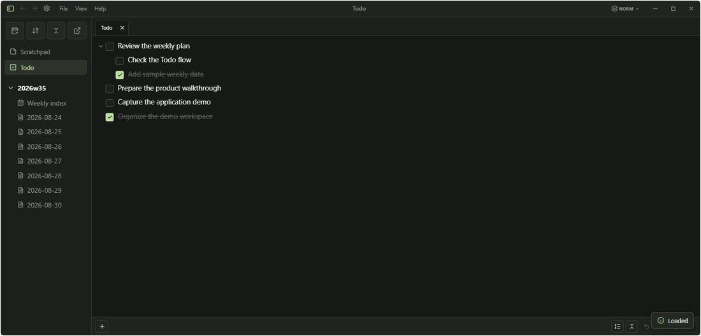

# Tracker Widget

Tracker Widget is a local-first desktop app for planning weeks, tracking daily activities, and organizing personal work in one focused workspace.

Your workspace is stored in portable Markdown files, but Tracker is not a general-purpose Markdown editor. Markdown is the storage format; the product focus is structured planning, activity tracking, and lightweight note-taking.

Built with Tauri, SvelteKit, and Rust.

Current version: `1.4.0`



## Highlights

- Manage todos with nesting, folding, keyboard navigation, multiselect, and bulk actions.
- Plan weekly objectives and activities with planned-versus-actual tracking.
- Record daily sessions, activities, subjects, durations, and notes.
- Use Scratchpad and daily or weekly notes for free-form writing when needed.
- Keep workspace data portable, human-readable, and accessible outside the app.
- Run the app as a portable desktop release.

## Workspace Layout

Normal use expects one workspace folder:

```text
workspace/
  todo.md
  scratchpad.md
  2026w27/
    2026w27_index.md
    20260701_log.md
    20260702_log.md
```

Unknown files are ignored. Missing week files can be checked or created for explicit week ranges from the sidebar. Missing `todo.md` can be created or imported from the Todo view. `scratchpad.md` is created lazily when Scratchpad is first opened.

## File Format

Tracker stores workspace data in Markdown files with a small set of Tracker-specific metadata conventions.

These fields describe application data such as subjects, status, durations, and planned activities while keeping the files human-readable and editable outside the app. A representative activity example appears in the Daily Logs section.

## Getting Started

1. Open the app.
2. Select a workspace folder.
3. Create or import `todo.md` if needed.
4. Use the calendar action in the sidebar to check the current week, create next week, or choose a week range.

Workspace location is managed from Settings. Todo and Scratchpad paths are derived as `<workspace>/todo.md` and `<workspace>/scratchpad.md`.

## Navigation

The sidebar keeps Todo and Scratchpad above the week tree. Use the tree to open weekly indexes and daily logs, or use **Back** and **Forward** to revisit recent views.

- `Ctrl + PageUp`: open the previous existing log.
- `Ctrl + PageDown`: open the next existing log.
- Navigation crosses week boundaries without expanding collapsed folders.
- The week-order control changes whether older or newer weeks appear first.

## Todo

Todo is a nested checklist with folding, keyboard navigation, selection, and bulk actions.

- `Enter`: add a todo.
- `Tab` / `Shift + Tab`: indent or outdent.
- `Alt + ArrowUp` / `Alt + ArrowDown`: reorder the focused todo.
- `Ctrl + click` and `Shift + click`: select multiple todos or a visible range.
- Use the toolbar and context menu for folding, editing, and send-to actions.

## Weekly Planning

Weekly indexes combine objectives, planned activities, and weekly actuals derived from daily logs.

- Objectives support nesting, folding, status, and subject metadata.
- Planned activities have stable IDs, subjects, and target durations.
- Planned and Actual views show aggregate duration totals; Actual remains read-only.
- Day columns can be collapsed temporarily, and planned cards can be duplicated.

## Daily Logs

Daily logs organize work into sessions, activities, subjects, durations, and notes. Session suggestions come from the current weekly plan and app-local session history.

Activity metadata uses a small, readable convention:

```markdown
- {subjects: (rust, ui), time: 120m} Refactored the settings panel layout.
```

Use `time: ?` when the duration is unknown. Mixed totals show the known lower bound with `+`; all-unknown totals show `?`.

## Notes and Scratchpad

Daily, weekly, and Scratchpad notes are edited as Markdown-based notes with live preview and source mode.

- Standard Markdown elements and task lists are supported.
- Scratchpad headings and nested lists can be folded without changing the file.
- Scratchpad is stored at `<workspace>/scratchpad.md`.
- Daily and weekly note boundaries keep headings inside notes from changing document structure.

## Settings

Settings control the workspace folder, frontmatter mode, history rebuilding, and Developer Mode. Todo and Scratchpad paths are derived from the selected workspace.

- `Off` keeps newly created daily logs and weekly indexes as clean Markdown without YAML frontmatter.
- `Personal` is an optional personal-workflow mode that adds YAML frontmatter to newly created daily logs and weekly indexes.

Subject and session history are app-local files and are ignored by Git:

- `subject-history.json`
- `session-history.json`

## Development

**Development note:** This project was human-directed and developed with substantial AI coding assistance. Product direction, design decisions, code review, and release preparation were led by me.

Install Node.js and Rust, then start the development app:

```bash
npm install
npm run tauri dev
```

Run the frontend and backend checks:

```bash
npm run test
npm run check
cargo test --manifest-path src-tauri/Cargo.toml
cargo check --manifest-path src-tauri/Cargo.toml
```

Build the frontend, release app, or portable package with:

```bash
npm run build
npm run tauri build
npm run package:portable
```

The portable zip is written to `build-artifacts/tracker-widget-portable-v1.4.0.zip`.
