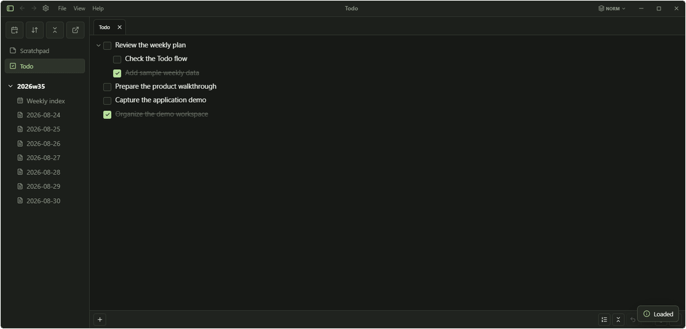

# Tracker Widget

Tracker Widget is a local-first desktop app for planning weeks, tracking daily activities, and organizing personal work in one focused workspace.

Your workspace is stored in portable Markdown files, but Tracker is not a general-purpose Markdown editor. Markdown is the storage format; the product focus is structured planning, activity tracking, and lightweight note-taking.

Built with Tauri, SvelteKit, TypeScript, and Rust.

Current version: `1.4.1`

Feature development is currently paused. Tracker remains a local desktop tool; this release does not add mobile access or cloud synchronization.



## Highlights

- Manage todos with nesting, folding, keyboard navigation, multiselect, and bulk actions.
- Plan weekly objectives and activities with planned-versus-actual tracking.
- Record daily sessions, activities, subjects, durations, and notes.
- Use Scratchpad and daily or weekly notes for free-form writing when needed.
- Keep workspace data portable, human-readable, and accessible outside the app.
- Run the app as a portable desktop release.

## Workspace Layout

Normal use expects one workspace folder:

```text
workspace/
  todo.md
  scratchpad.md
  2026w27/
    2026w27_index.md
    20260701_log.md
    20260702_log.md
```

Unknown files are ignored. Missing week files can be checked or created for explicit week ranges from the sidebar. Missing `todo.md` can be created or imported from the Todo view. Opening a missing Scratchpad shows a placeholder; the file is created only when you choose **Create scratchpad**.

## Saving and External Changes

Edits are automatically saved after a 250 ms delay. Todo, Scratchpad, daily logs, and weekly indexes share the same document lifecycle, including safe navigation and save-error recovery.

If an external edit is detected while the document has no unsaved changes, Tracker reloads it automatically. If local changes are pending, a notification at the bottom of the owning pane offers **Reload External** or **Keep Local**. Keep Local saves the latest local text; Reload External reads the current file again.

A failed read or write preserves local edits and prevents affected file switches, tab closing, and pane transfers from discarding them. Resolve the error or conflict and retry the operation. Markdown formats are unchanged in v1.4.1; existing workspaces require no migration.

## File Format

Tracker stores workspace data in Markdown files with a small set of Tracker-specific metadata conventions.

These fields describe application data such as subjects, status, durations, and planned activities while keeping the files human-readable and editable outside the app. A representative activity example appears in the Daily Logs section.

## Getting Started

1. Open the app.
2. Select a workspace folder.
3. Create or import `todo.md` if needed.
4. Use the calendar action in the sidebar to check the current week, create next week, or choose a week range.

Workspace location is managed from Settings. Todo and Scratchpad paths are derived as `<workspace>/todo.md` and `<workspace>/scratchpad.md`.

## Navigation

The sidebar keeps Todo and Scratchpad above the week tree. Use the tree to open weekly indexes and daily logs, or use **Back** and **Forward** to revisit recent views.

Todo, Scratchpad, weekly indexes, and daily logs open in workspace tabs. Use sidebar and tab context menus to open or move a tab into a two-pane Split View, then drag the divider to resize the panes. Each file has one editable tab across both panes; opening it again focuses its existing tab. Back and Forward follow focus history across both panes.

- `Ctrl + PageUp`: open the previous existing log.
- `Ctrl + PageDown`: open the next existing log.
- Navigation crosses week boundaries without expanding collapsed folders.
- The week-order control changes whether older or newer weeks appear first.

## Todo

Todo is a nested checklist with folding, keyboard navigation, selection, and bulk actions.

- `Enter`: add a todo.
- `Tab` / `Shift + Tab`: indent or outdent.
- `Alt + ArrowUp` / `Alt + ArrowDown`: reorder the focused todo.
- `Ctrl + click` and `Shift + click`: select multiple todos or a visible range.
- Use the toolbar and context menu for folding, editing, and send-to actions.

## Weekly Planning

Weekly indexes combine objectives, planned activities, and weekly actuals derived from daily logs.

- Objectives support nesting, folding, status, and subject metadata.
- Planned activities have stable IDs, subjects, and target durations.
- Planned and Actual views show aggregate duration totals; Actual remains read-only.
- Day columns can be collapsed temporarily, and planned cards can be duplicated.

## Daily Logs

Daily logs organize work into sessions, activities, subjects, durations, and notes. Session suggestions come from the current weekly plan and app-local session history.

Activity metadata uses a small, readable convention:

```markdown
- {subjects: (rust, ui), time: 120m} Refactored the settings panel layout.
```

Use `time: ?` when the duration is unknown. Mixed totals show the known lower bound with `+`; all-unknown totals show `?`.

## Notes and Scratchpad

Daily, weekly, and Scratchpad notes are edited as Markdown-based notes with live preview and source mode.

- Standard Markdown elements and task lists are supported.
- Scratchpad headings and nested lists can be folded without changing the file.
- Scratchpad is stored at `<workspace>/scratchpad.md`.
- Daily and weekly note boundaries keep headings inside notes from changing document structure.

## Settings

Settings control the workspace folder, frontmatter mode, history rebuilding, and Developer Mode. Todo and Scratchpad paths are derived from the selected workspace.

- `Off` is the normal mode. It keeps newly created daily logs and weekly indexes as clean Markdown without YAML frontmatter.
- `Personal` adds YAML frontmatter for the author's own workflow. It is intended for the author, not for general use; other users should leave this setting at `Off`.

Subject and session history are app-local files and are ignored by Git:

- `subject-history.json`
- `session-history.json`

## Development

**Development note:** This project was human-directed and developed with substantial AI coding assistance. Product direction, design decisions, code review, and release preparation were led by me.

Install Node.js **24.12.0 or newer**, Rust, and the [Tauri development prerequisites](https://v2.tauri.app/start/prerequisites/), then start the development app:

```bash
npm install
npm run tauri dev
```

Run the frontend and backend checks:

```bash
npm run test
npm run check
cargo test --manifest-path src-tauri/Cargo.toml
cargo check --manifest-path src-tauri/Cargo.toml
```

Build the frontend, release app, or portable package with:

```bash
npm run build
npm run tauri build
npm run package:portable
```

Application modules, frontend tests, and Svelte scripts use strict TypeScript. `npm run check` checks the tests as well as application code. Maintenance scripts remain `.mjs` and use Node's native TypeScript support for parser imports.
